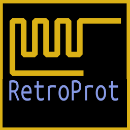

# RetroProtServer



Servidor de juegos y ficheros genérico para máquinas retro usando el protocolo RetroProt.

https://github.com/yomboprime/Retroprot

## Protocolos

Especificación del protocolo de juegos: [Link](./Especificación_RetroProt/Especificacion_RetroProt_Game_Server.md)

Especificación del protocolo de ficheros: [Link](./Especificación_RetroProt/Especificacion_RetroProt_File_Server.md)

## Clientes

#### Clientes de ficheros

Para ZXUno

- Para ESXDOS: [Link](./public/Filebrow/Filebrow.tap)
- Para +3e: [Link](./public/Fileplus/Fileplus.tap)

Código fuente de los clientes: [Link](https://github.com/yomboprime/ZXYLib)

Nota: En el cliente de +3e:

- Los ficheros descargados deben llevar cabecera +3DOS o no serán legibles después de la descarga. Los ficheros subidos contendrán la cabecera.
- La unidad accedida es la actual por defecto. El fichero de configuración se cargará de la misma.

#### Instalación de los clientes de ficheros

##### ESXDOS

- Copia ```public/FileBrow/FileBrow.tap``` a donde quieras en la SD.
- Edita ```public/FileBrow/RPROT.CFG``` poniendo credenciales WiFi y IP del servidor.
- Copia ```public/FileBrow/RPROT.CFG``` a ```SYS/CONFIG```.

##### +3e

- Copia ```public/FilePlus/FILEPLUS.BAS``` y ```public/FilePlus/FilePlus.bin``` a la SD.
- Edita ```public/FileBrow/RPROT.CFG``` poniendo credenciales WiFi y IP del servidor.
- Añade la cabecera +3DOS a ```public/FileBrow/RPROT.CFG```.
- Copia ```public/FileBrow/RPROT.CFG``` a la SD.


#### Uso de los clientes

- Se navega con los cursores.
- ```Enter``` para subir o descargar fichero.
- Tecla ```o``` para cambiar la ordenación del panel izquierdo (el que muestra los ficheros del servidor).

## Instalación del servidor

### Prerrequisitos

Necesitas nodejs instalado:

```sudo apt install nodejs```

o ve a https://nodejs.org

También git:

```sudo apt install git```


### Instalación

Suponiendo que se quiera instalar en home, ```~/```:

```
cd ~
git clone https://github.com/yomboprime/Retroprot.git
cd Retroprot
npm install
```

### Ejecución

```
cd ~/Retroprot
npm start
```

Para detener la ejecución pulsar ```Ctrl-C```.

El subdirectorio ```public/``` es el que se publica a los clientes de ficheros. Puedes añadir, quitar o cambiar ficheros en cualquier momento.

## Agradecimientos

Los clientes de ficheros han sido posible gracias al esfuerzo de:

Nihirash: Ayuda con el modo de conexión directa del ESP8266 y con código de acceso a +3DOS.

desUBIKado: Idea original de hacerlo funcionar en +3DOS y de subidas al servidor. Betatesting.

C: Ayuda con el ZX Spectrum en general.

Mejias3D: Icono del rayo y de la carpeta. Ayuda con la depuración.

yombo: Código y pruebas.
